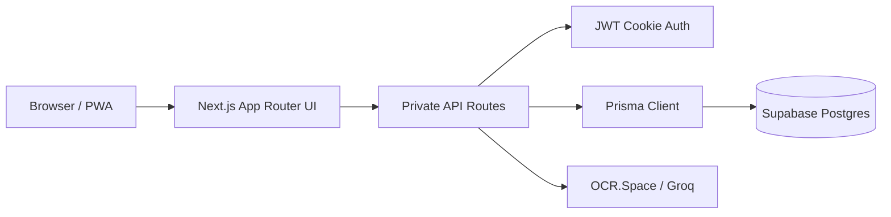

<p align="center">
  <picture>
    <source media="(prefers-color-scheme: dark)" srcset="./public/branding/finku-white-512.png">
    
  </picture>
</p>

<h1 align="center">Finku</h1>

<p align="center">
  <strong>Financial Management</strong><br />
  Personal finance app berbasis Next.js, Prisma, dan Supabase untuk mengelola pemasukan, pengeluaran, anggaran, serta alur transaksi yang dibantu OCR dan AI.
</p>

<p align="center">
  <a href="#quick-start">Quick Start</a>
  ·
  <a href="#stack">Stack</a>
  ·
  <a href="#environment">Environment</a>
  ·
  <a href="#security--data-model">Security</a>
  ·
  <a href="#scripts">Scripts</a>
</p>

<p align="center">
  
  
  
  
  
</p>

> Arsitektur saat ini memakai satu database Supabase Postgres bersama, isolasi data privat per `userId`, auth cookie berbasis JWT untuk route privat, dan tidak menyimpan default admin credentials di source code maupun SQL.

<details>
  <summary><strong>Why Finku</strong></summary>

  - Dashboard untuk saldo, income, expenses, savings, chart bulanan, dan performa kategori.
  - Riwayat transaksi lengkap dengan create, edit, delete, import batch, dan OCR struk.
  - Alokasi anggaran per bulan dan progress budget per kategori.
  - Admin bootstrap aman tanpa user demo hardcoded.
  - Template data per user agar setiap akun baru langsung punya kategori, budget, dan contoh transaksi sendiri.
</details>

## Stack

| Layer | Tools |
| --- | --- |
| App | Next.js 16, React 19, TypeScript 5 |
| UI | Tailwind CSS 4, Radix UI, Framer Motion |
| Data | Prisma, Supabase Postgres |
| State | TanStack Query, React Context |
| Assistive input | OCR.Space, Groq |

## Architecture



## Quick Start

1. Install dependency.

```bash
bun install
```

2. Salin env template lalu isi nilai yang dibutuhkan.

```bash
cp .env.example .env
```

3. Generate Prisma client dan push schema.

```bash
bun run db:generate
bun run db:push
```

4. Bootstrap admin pertama via environment variables.

```bash
$env:ADMIN_BOOTSTRAP_USERNAME="admin"
$env:ADMIN_BOOTSTRAP_PASSWORD="replace-with-a-strong-password"
$env:ADMIN_BOOTSTRAP_NAME="Administrator"
$env:ADMIN_BOOTSTRAP_EMAIL="admin@example.com"
bun run admin:bootstrap
```

5. Jalankan development server.

```bash
bun run dev
```

6. Jika environment sudah punya user lama dan Anda ingin melengkapi template data mereka:

```bash
bun run users:backfill-template
```

Backfill ini idempotent: hanya mengisi data template yang belum ada, tanpa menghapus atau mengganti data milik user.

## Environment

| Variable | Required | Keterangan |
| --- | --- | --- |
| `DATABASE_URL` | Yes | URL koneksi utama Prisma. Untuk Supabase pooler gunakan `?pgbouncer=true&connection_limit=1`. |
| `DIRECT_DATABASE_URL` | Yes | Direct connection untuk migrasi atau operasi yang tidak lewat pooler. |
| `JWT_SECRET` | Yes | Minimal 32 karakter acak. Placeholder value akan ditolak saat runtime. |
| `OCR_SPACE_API_KEY` | No | Mengaktifkan OCR untuk fitur scan struk. |
| `GROQ_API_KEY` | No | Mengaktifkan voice transcription dan AI transaction draft. |
| `ENABLE_ACTIVE_USERS_METRIC` | No | Set `false` untuk mematikan output demo `/api/users/active`. |

## Security & Data Model

- `Transaction`, `Category`, `Budget`, dan `UserSettings` selalu terikat ke satu user lewat `userId`.
- Route privat mengidentifikasi user dari auth cookie dan memfilter query sesuai ownership.
- Route detail melakukan ownership check sebelum read, update, atau delete.
- Password disimpan sebagai hash bcrypt saja.
- User baru yang dibuat admin otomatis diprovision dengan kategori default, budget bulan berjalan, sample transaction, dan user settings.
- Formula summary resmi:
  `balance = income - expenses - savings`
- Formula savings rate resmi:
  `savingsRate = savings / income * 100`

<details>
  <summary><strong>Import, OCR, dan AI</strong></summary>

  - Import batch menerima `.csv`, `.xlsx`, dan `.xlsm`.
  - Ukuran file maksimal 5MB.
  - Maksimal 1000 baris per import.
  - Import menolak formula spreadsheet berbahaya serta tanggal dan nominal yang tidak valid.
  - `Scan Struk` memakai OCR.Space untuk mengekstrak teks struk lalu membentuk draft transaksi yang bisa diedit.
  - `Tambah Transaksi` mendukung input manual atau draft hasil chat/voice.
  - Voice input ditranskrip server-side via Groq sebelum diubah menjadi draft transaksi.
</details>

## Scripts

| Command | Fungsi |
| --- | --- |
| `bun run dev` | Menjalankan app di mode development |
| `bun run build` | Build production |
| `bun run lint` | Validasi lint |
| `bun run test` | Menjalankan test Node yang tersedia |
| `bun run db:generate` | Generate Prisma client |
| `bun run db:push` | Push schema ke database |
| `bun run db:seed` | Seed data manual jika diperlukan |
| `bun run admin:bootstrap` | Membuat admin pertama dan template data per-user |
| `bun run users:backfill-template` | Backfill template data user lama |
| `bun run passwords:migrate` | Migrasi password plaintext lama ke bcrypt |

## Supabase Bootstrap

Untuk database Supabase yang masih kosong:

1. Terapkan [`supabase-schema.sql`](./supabase-schema.sql) atau jalankan `bun run db:push`.
2. Isi environment `ADMIN_BOOTSTRAP_*`.
3. Jalankan `bun run admin:bootstrap`.
4. Jika harus bootstrap dari Supabase SQL Editor, mulai dari [`scripts/supabase-bootstrap-admin.template.sql`](./scripts/supabase-bootstrap-admin.template.sql) lalu ganti placeholder-nya secara lokal.

`supabase-schema.sql` sengaja tidak memasukkan default admin ataupun sample data global. Seluruh provisioning dilakukan di layer aplikasi supaya tiap user menerima data template yang tetap terisolasi.

## Password Migration

Jika environment lama masih menyimpan password plaintext:

```bash
bun run passwords:migrate
```

Setelah migrasi, fallback login plaintext tidak lagi diterima.
